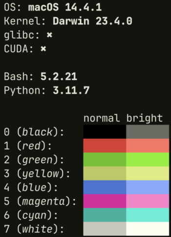
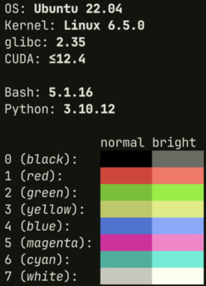

# soft

## Description
Fetch tool for software information. Shows the operating system, the kernel, the bash version and the glibc version.

 

## Installation
1)  Clone the repository:

        git clone https://github.com/gvlassis/soft

1)  cd to the cloned repository and run the script:

        cd soft
        ./src/soft.sh